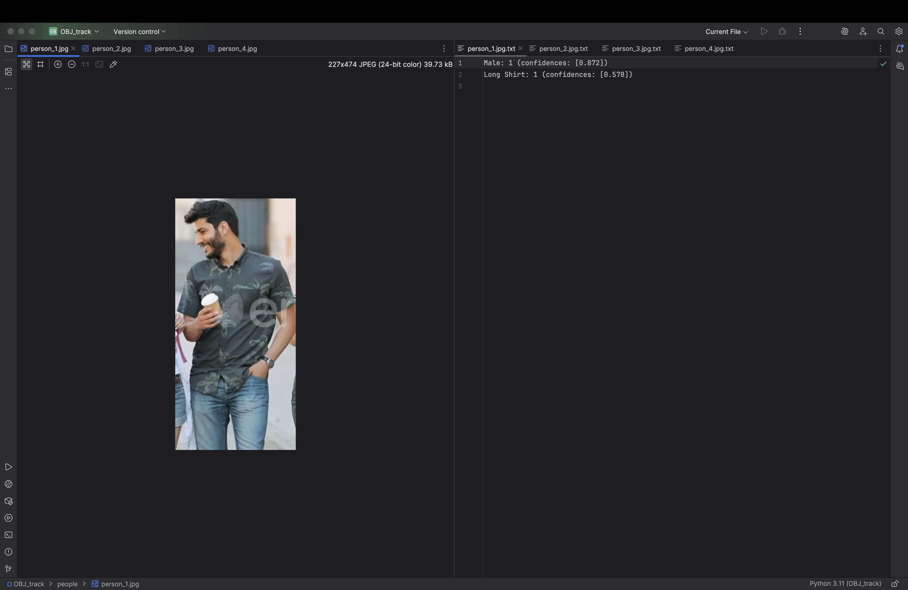
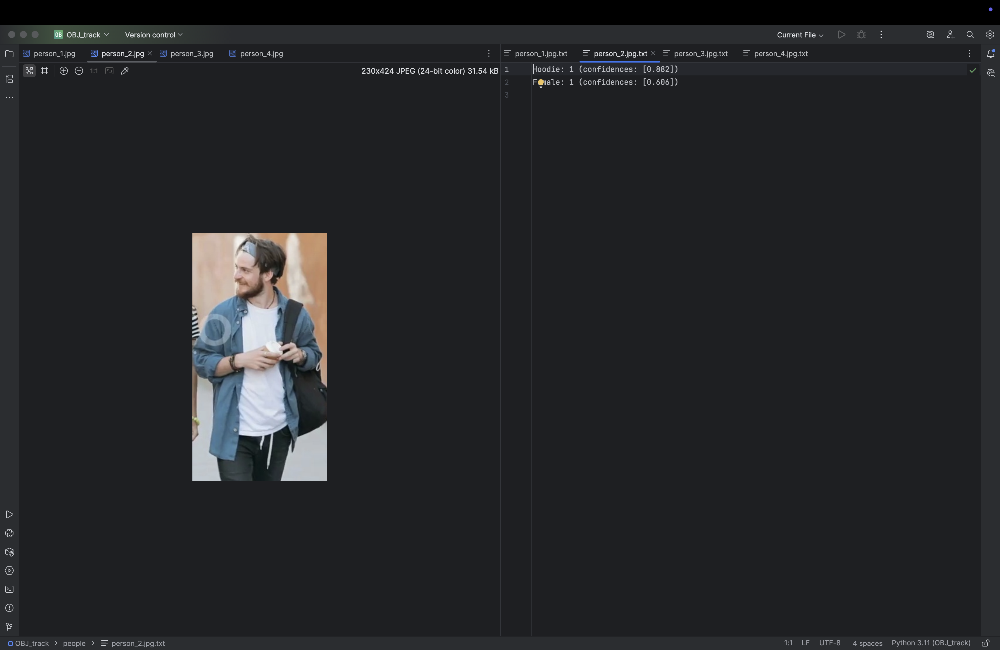
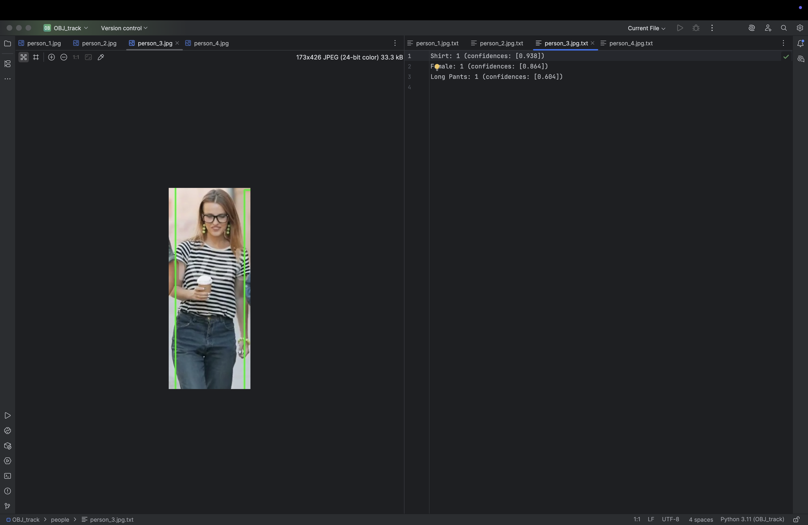
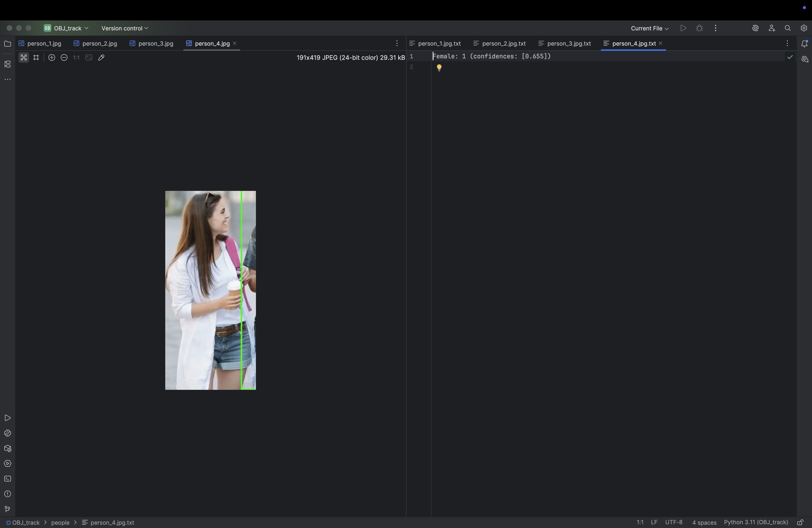
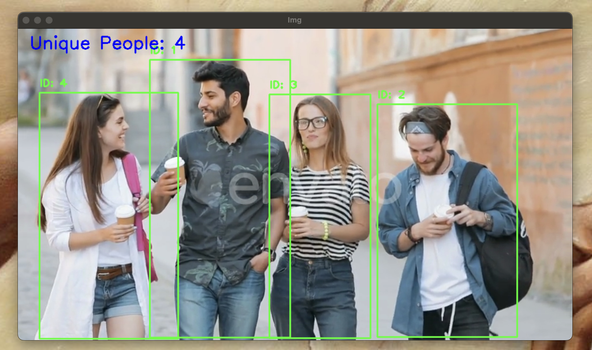

# Multi-Phase-Yolo-Image-classifier

A two-stage, real-time video pipeline that first uses YOLOv8 to detect and crop persons, then applies Deep SORT for persistent tracking so each individual is only processed once, and finally runs a second YOLO model to classify their clothing—saving each new person’s image along with a detailed breakdown of apparel counts and confidence scores.

This setup supports any pretrained or retrained YOLO model (person detector & clothing classifier), including custom models trained via the Roboflow API and the YOLO model training API.

## Features

- **Two-Stage Classification**  
  1. Person detection (YOLOv8)  
  2. Clothing classification (YOLOv8)  
- **Custom Models Supported**  
  - Default person detector: `yolo11s.pt`  
  - Custom clothing classifier: `cloth_detect_v2.pt` (trained via Roboflow & YOLO APIs)  
- **Persistent Tracking**: Deep SORT (max_age=300) to remember individuals  
- **Output**:  
  - Cropped images in `people/`  
  - Apparel counts & confidence scores in `.txt` files  

## Prerequisites

- Python 3.x  
- OpenCV (`cv2`)  
- PyTorch (MPS/CUDA)  
- `ultralytics` YOLO package  
- `deep_sort_realtime` tracker  

```bash
pip install opencv-python torch ultralytics deep_sort_realtime
```

## Usage

1. Place your input video (e.g., `4friends.mp4`) in `test_Videos/`.  
2. Run the classifier:
   ```bash
   python multi_stage_classifier.py
   ```
3. Check `people/` for results:
   - `person_<ID>.jpg`  
   - `person_<ID>.jpg.txt`  

## Demo

### Cropped Person Examples

Below are examples of cropped person images with their corresponding classification outputs:
<br>

| Person Image        | Classification Summary         |
|---------------------|--------------------------------|
|  | Contents of `person_1.jpg.txt` |
|  | Contents of `person_2.jpg.txt` |
|  | Contents of `person_3.jpg.txt` |
|  | Contents of `person_4.jpg.txt` |

### Full Scene with Tracking



## File Structure

```
Multi-Phase-Yolo-Image-classifier/
├── multi_stage_classifier.py
├── yolo11s.pt
├── cloth_detect_v2.pt
├── test_Videos/
│   └── 4friends.mp4
├── people/
│   ├── person_1.jpg
│   ├── person_1.jpg.txt
│   ├── person_2.jpg
│   ├── person_2.jpg.txt
│   ├── person_3.jpg
│   ├── person_3.jpg.txt
│   ├── person_4.jpg
│   └── person_4.jpg.txt
├── images/
│   └── pipeline_demo.png
├── videos/
│   └── demo.mp4
├── Scene.png
├── LICENSE
└── README.md
```

## License

This project is licensed under the GNU Affero General Public License v3.0 (AGPL-3.0). See [LICENSE](LICENSE) for details.

## Author

Oluwabukunmi Jaiyeola
